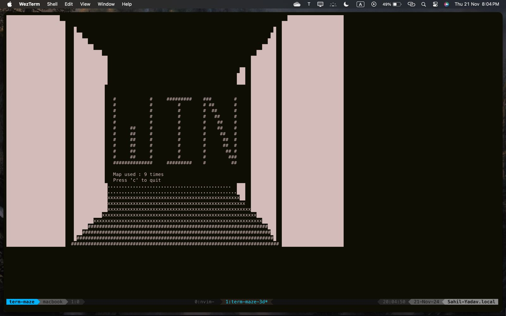

# termi-maze-3d

A maze in your terminal written in Go

## contents
- [Demo](#demo)
- [Map](#map)
- [Principles Used](#principle-used)
- [Installation](#installation)

## Demo
Click the image to watch the playthrough
[](https://www.youtube.com/watch?v=jSCObg4g06g)

## Map
```
"####################################"
"#  #        #s          # #    #   #"
"# ## #####  #  ######## # #    # p #"
"#  #   #    #         # #   ## # r #"
"## #   #    #         # #####  # e #"
"#  ### #  ######## #  #        # s #"
"# ## # #       # # #  #      # # s #"
"#    # #       # # #  ######## #   #"
"#### # #   ##  # # #         # # m #"
"#    # #   #   # # #         # #   #"
"## ### #####   #   ########### # f #"
"#    #     #   # ###  #        # o #"
"# ####     #   #   #  #        # r #"
"#   #  #   #   # # #       #####   #"
"#   #  ### #   # # #    ####   # m #"
"# #    #   #   # ####  ##      # a #"
"# #    #   #####    #      # ### p #"
"# # #  ##      ###  #    ###   # _ #"
"# # #  #         ## #      #   # p #"
"# # # #####       ###########  # r #"
"# #####  #   ######            # e #"
"#   #    #                   ### s #"
"#   #    #    ######  ##  ##   # s #"
"#   #  ###    #       #    #   #   #"
"#   #    # #  #  ###########   # c #"
"#   #      #  #  #   #    #  ###   #"
"# #### #####  #  #   #    ##   # t #"
"# #    #   #  #  # ######  ##  # o #"
"# #   ## ###  ####      #      #   #"
"# #  ##          ####   #####  # q #"
"#     #                e#      # u #"
"################################ i #"
"# w : up        # s : down     # t #"
"# a : left      # d : right    #   #"
"# q : rotate(l) # e : rotate(r)#   #"
"####################################"
```
the goal is to go from 's' to 'e'

## Principle Used
This 2D map is converted into a 3D world using Ray Casting. Multiple rays are emitted from a source(the player here).
The distances of walls are computed via these rays.
The walls that are further away have more ceilings and floors in the 3D world.
The closer walls have less ceiling and floor.
The ceiling, floor and walls are then drawn on a fixed buffer which is then printed out on the terminal screen.

## Installation
clone this repo and cd into it
```zsh
git clone https://github.com/Yadav106/termi-maze-3d
cd termi-maze-3d
```

build the executable
```zsh
go build
```

an executable named `termi-maze-3d` must be generated in your directory after the above steps, now run it
```zsh
./termi-maze-3d
```


